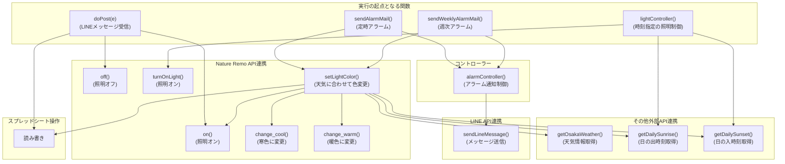

```mermaid
graph TD
    subgraph Triggers [実行の起点となる関数]
        direction LR
        doPost["doPost(e)<br>(LINEメッセージ受信)"]
        sendAlarmMail["sendAlarmMail()<br>(定時アラーム)"]
        sendWeeklyAlarmMail["sendWeeklyAlarmMail()<br>(週次アラーム)"]
        lightController["lightController()<br>(時刻指定の照明制御)"]
    end

    subgraph Controllers [コントローラー]
        alarmController["alarmController()<br>(アラーム通知制御)"]
    end

    subgraph LineAPI [LINE API連携]
        sendLineMessage["sendLineMessage()<br>(メッセージ送信)"]
    end

    subgraph NatureRemoAPI [Nature Remo API連携]
        on["on()<br>(照明オン)"]
        off["off()<br>(照明オフ)"]
        change_cool["change_cool()<br>(寒色に変更)"]
        change_warm["change_warm()<br>(暖色に変更)"]
        turnOnLight["turnOnLight()<br>(照明オン)"]
        setLightColor["setLightColor()<br>(天気に合わせて色変更)"]
    end

    subgraph ExternalAPI [その他外部API連携]
        getOsakaWeather["getOsakaWeather()<br>(天気情報取得)"]
        getDailySunrise["getDailySunrise()<br>(日の出時刻取得)"]
        getDailySunset["getDailySunset()<br>(日の入時刻取得)"]
    end

    subgraph Spreadsheet [スプレッドシート操作]
        sheet_read_write["読み書き"]
    end

    %% --- 呼び出し関係 ---

    doPost --> on
    doPost --> off
    doPost --> sheet_read_write

    sendAlarmMail --> alarmController
    sendAlarmMail --> setLightColor

    sendWeeklyAlarmMail --> alarmController
    sendWeeklyAlarmMail --> setLightColor

    lightController --> turnOnLight
    lightController --> getDailySunrise
    lightController --> getDailySunset

    alarmController --> sendLineMessage

    setLightColor --> on
    setLightColor --> change_cool
    setLightColor --> change_warm
    setLightColor --> getOsakaWeather
    setLightColor --> getDailySunrise
    setLightColor --> getDailySunset
    setLightColor --> sheet_read_write
```