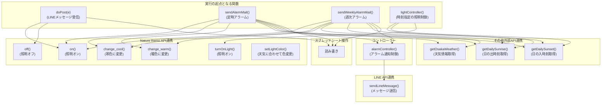

```mermaid
graph TD
    subgraph Triggers [実行の起点となる関数]
        direction LR
        doPost["doPost(e)\n(LINEメッセージ受信)"]
        sendAlarmMail["sendAlarmMail()\n(定時アラーム)"]
        sendWeeklyAlarmMail["sendWeeklyAlarmMail()\n(週次アラーム)"]
        lightController["lightController()\n(時刻指定の照明制御)"]
    end

    subgraph Controllers [コントローラー]
        alarmController["alarmController()\n(アラーム通知制御)"]
    end

    subgraph LineAPI [LINE API連携]
        sendLineMessage["sendLineMessage()\n(メッセージ送信)"]
    end

    subgraph NatureRemoAPI [Nature Remo API連携]
        on["on()\n(照明オン)"]
        off["off()\n(照明オフ)"]
        change_cool["change_cool()\n(寒色に変更)"]
        change_warm["change_warm()\n(暖色に変更)"]
        turnOnLight["turnOnLight()\n(照明オン)"]
        setLightColor["setLightColor()\n(天気に合わせて色変更)"]
    end

    subgraph ExternalAPI [その他外部API連携]
        getOsakaWeather["getOsakaWeather()\n(天気情報取得)"]
        getDailySunrise["getDailySunrise()\n(日の出時刻取得)"]
        getDailySunset["getDailySunset()\n(日の入時刻取得)"]
    end

    subgraph Spreadsheet [スプレッドシート操作]
        sheet_read_write["読み書き"]
    end

    %% --- 呼び出し関係 ---

    doPost --> on
    doPost --> off
    doPost --> sheet_read_write

    sendAlarmMail --> on
    sendAlarmMail --> change_cool
    sendAlarmMail --> change_warm
    sendAlarmMail --> getOsakaWeather
    sendAlarmMail --> getDailySunrise
    sendAlarmMail --> getDailySunset
    sendAlarmMail --> alarmController
    sendAlarmMail --> sheet_read_write

    sendWeeklyAlarmMail --> on
    sendWeeklyAlarmMail --> change_cool
    sendWeeklyAlarmMail --> change_warm
    sendWeeklyAlarmMail --> getOsakaWeather
    sendWeeklyAlarmMail --> getDailySunrise
    sendWeeklyAlarmMail --> getDailySunset
    sendWeeklyAlarmMail --> alarmController
    sendWeeklyAlarmMail --> sheet_read_write

    lightController --> getDailySunrise
    lightController --> getDailySunset
    lightController --> turnOnLight

    alarmController --> sendLineMessage
```