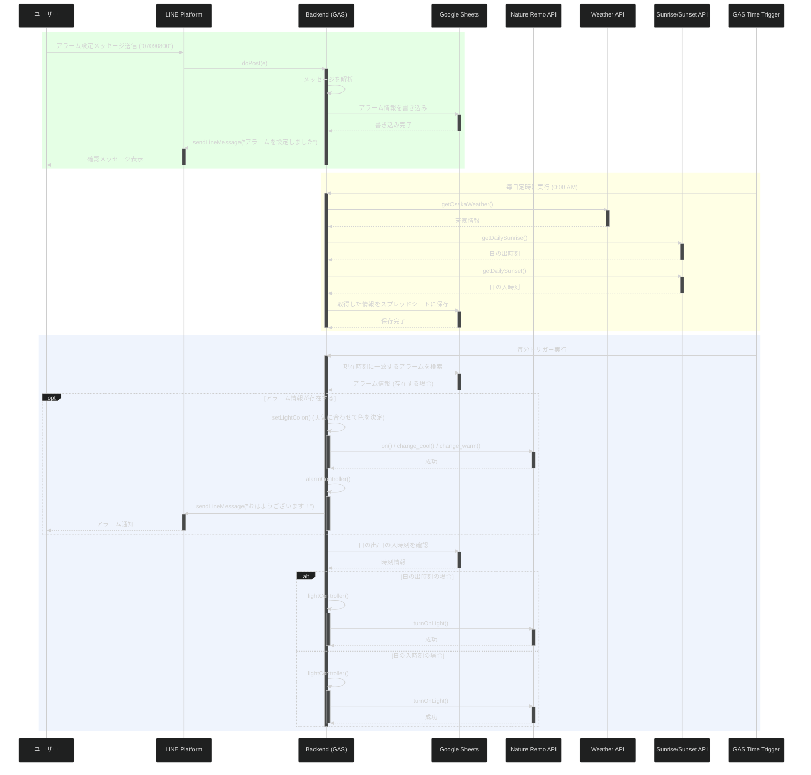

```mermaid
%%{init: {'theme': 'dark'}}%%
sequenceDiagram
    participant User as ユーザー
    participant Line as LINE Platform
    participant Gas as Backend (GAS)
    participant Sheets as Google Sheets
    participant Remo as Nature Remo API
    participant Weather as Weather API
    participant Sun as Sunrise/Sunset API
    participant Trigger as GAS Time Trigger

    rect rgba(0, 255, 0, 0.1)
    %% シナリオ1: LINEからのアラーム設定
    User->>Line: アラーム設定メッセージ送信 ("07090800")
    Line->>Gas: doPost(e)
    activate Gas
    Gas->>Gas: メッセージを解析
    Gas->>Sheets: アラーム情報を書き込み
    activate Sheets
    Sheets-->>Gas: 書き込み完了
    deactivate Sheets
    Gas->>Line: sendLineMessage("アラームを設定しました")
    activate Line
    Line-->>User: 確認メッセージ表示
    deactivate Line
    deactivate Gas
    end

    rect rgba(255, 255, 0, 0.1)
    %% シナリオ2: 毎日の初期化処理 (深夜に実行)
    Trigger->>Gas: 毎日定時に実行 (0:00 AM)
    activate Gas
    Gas->>Weather: getOsakaWeather()
    activate Weather
    Weather-->>Gas: 天気情報
    deactivate Weather
    Gas->>Sun: getDailySunrise()
    activate Sun
    Sun-->>Gas: 日の出時刻
    deactivate Sun
    Gas->>Sun: getDailySunset()
    activate Sun
    Sun-->>Gas: 日の入時刻
    deactivate Sun
    Gas->>Sheets: 取得した情報をスプレッドシートに保存
    activate Sheets
    Sheets-->>Gas: 保存完了
    deactivate Sheets
    deactivate Gas
    end

    rect rgba(100, 149, 237, 0.1)
    %% シナリオ3: 定時実行処理 (毎分実行)
    Trigger->>Gas: 毎分トリガー実行
    activate Gas

    %% アラーム実行フロー
    Gas->>Sheets: 現在時刻に一致するアラームを検索
    activate Sheets
    Sheets-->>Gas: アラーム情報 (存在する場合)
    deactivate Sheets
    opt アラーム情報が存在する
        Gas->>Gas: setLightColor() (天気に合わせて色を決定)
        activate Gas
        Gas->>Remo: on() / change_cool() / change_warm()
        activate Remo
        Remo-->>Gas: 成功
        deactivate Remo
        deactivate Gas

        Gas->>Gas: alarmController()
        activate Gas
        Gas->>Line: sendLineMessage("おはようございます！")
        activate Line
        Line-->>User: アラーム通知
        deactivate Line
        deactivate Gas
    end

    %% 照明制御フロー
    Gas->>Sheets: 日の出/日の入時刻を確認
    activate Sheets
    Sheets-->>Gas: 時刻情報
    deactivate Sheets
    alt 日の出時刻の場合
        Gas->>Gas: lightController()
        activate Gas
        Gas->>Remo: turnOnLight()
        activate Remo
        Remo-->>Gas: 成功
        deactivate Remo
        deactivate Gas
    else 日の入時刻の場合
        Gas->>Gas: lightController()
        activate Gas
        Gas->>Remo: turnOnLight()
        activate Remo
        Remo-->>Gas: 成功
        deactivate Remo
        deactivate Gas
    end
    deactivate Gas
    end
```